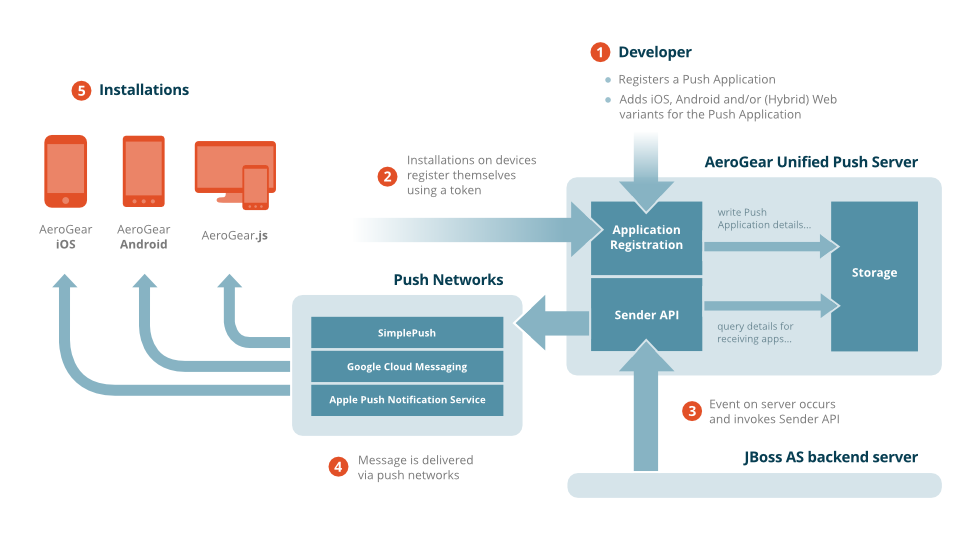

# How the UnifiedPush Server Works

The AeroGear UnifiedPush Server can be seen as a broker that distributes push messages to different 
3rd party Push Networks. The graphic below gives a little overview:
 

1. A PushApplication and at least one mobile platform variant must be created
1. The variant credentials that are generated and stored by the UnifiedPush Server must be added to the mobile 
application source, enabling the application running on the mobile device to register with the UnifiedPush Server 
once it is installed on mobile devices (see tutorials).
1. Sending a push message can happen in different ways: The AdminUI can be used to send a (test) message to 
registered devices, as explained in Sending a Push Notification. However, in a real-world scenario the Push 
Notification Message request is triggered from a backend application, which sends its requests using the Sender API. 
1. The push request is then translated into platform specific details for the required variant Push Network. 
The Dashboard of the AdminUI gives a status report if a message is sent to the Push Network.
1. The UnifiedPush Server does not directly deliver the message to the mobile device. This is done by the 
appropriate variant Push Network. Note: There can be latency in the actual delivery. Most Push Networks, 
such as APNs or GCM, do not guarantee to deliver messages to mobile devices.

