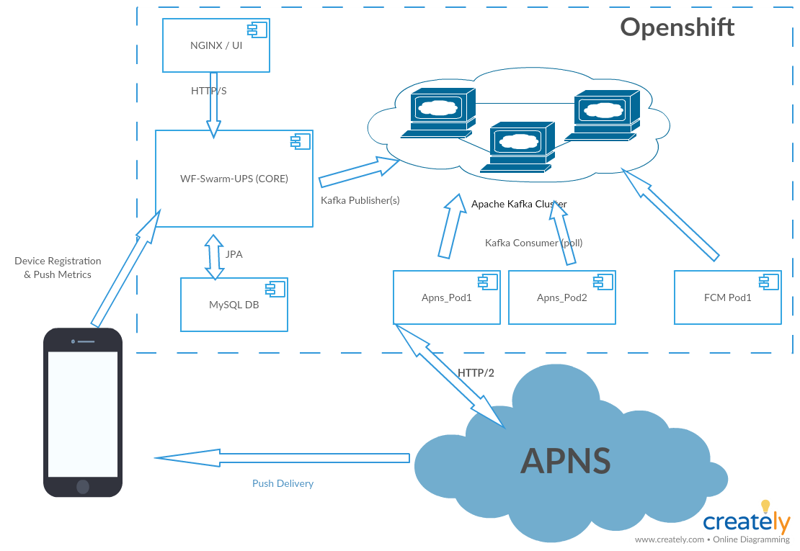

# Abstract

This document outlines a modularization approach of the UPS, for better scalablitly and lower footprint when running large push workloads

## Goals

* better scalablitly through modularization of the network heavy sender processes
* lower footprint, by breaking workloads out of the _core_ Push Server 

## Terms

 - Kafka: [distributed and partioned commit log, with message system semantics](https://speakerdeck.com/matzew/eclipse-microprofile-and-apache-kafka?slide=9)
 - Pod: Group of containers deployed on the same host
 - JavaEE: framework for writing managed servers with build-in features for persistence, transaction and dependency injection. Applications are typically deployed in an archive (`WAR`).
 - WildFly Swarm: Java EE microservice tool
 - nginx: https server and proxy 
 - System Resources: CPU or memory

## Problem

The UPS 1.2.x line is hard to scale and requires a good amount of system resources. Currently all of the push functionality is baked into one bigger `WAR` file:
 - housekeeping/crud for all the metadata for PushApplications, their Variants and their devices.
 - Lookup of the device tokens for a push deliver
 - Push delelivery to the different 3rd party push networks (such as APNs or FCM)
 - simple analytics about Push Notifications

In the past we have seen problems when a larger amount of push notifications were sent. Problems with lot's of push delivery connections to the different 3rd networks, e.g. hanging/stale connections, did cause memory issues, which eventually did cause the entire server (or system) to fail.

Another problem is that the current architecture lacks of good ways to (horizontally) scale **only** the busy parts of the _push system_. In a perfect world it would be trivial to scale up only those parts that are currently busy. However, currently it's not possible, only the entire server can be replicated.

## Proposed solution

Refactoring the current UPS into a more modular system, or a system of systems.

### Apache Kafka

Decoupling the process of push delivery by using messaging. Based on the [Google-Summer-of-Code project from 2017](https://github.com/aerogear/aerogear-unifiedpush-server/tree/GSOC_2017_kafka) to replace the internal JMS broker with an external Kafka broker, we can leverage this work and move the different _push sender_ components into their own systems or modules, as individual servers.

One of the big scaling benefits of Apache Kafka is that it's possible to partion a topic, and attach multiple consumers, organzied in consumer groups, to one topic. 
Any message sent to the topic is processed by exactly a single consumer in each consumer group, subscribed to the topic. The consumers can be deployed on different hosts, for a better horizontal scaling. 

A nice side-effect of using Apache Kafka is that due to its default durability, the system can be used to later process and analyize all traffic, such as all push notifications. Even a replay of the entire message stream on different consumer groups is possible. This is great for event sourcing and also deep analytics of our push payload.

### Sender Modules

Each _Sender component_ would be refactored into a separate java process, that represents a stateless Kafka consumer, subscribed to it's matching topic, which than triggers the push delivery to the 3rd party networks, such as:

```java

consumer.subscribe(Collections.singleton(APNS_TOPIC));

while (isRunning()) {
  final ConsumerRecords<String, MessageHolderWithTokens> records = consumer.poll(...);

  records.forEach(record -> {

    final MessageHolderWithTokens messageContainer = record.value();
    sender.sendPushMessage(messageContainer);
  }
}
```

The consumer thread actively polls the push payload (the `MessageHolderWithTokens` object) from the broker, allowing the consumer also to slow down if it can not keep up. Consumers are organized in consumer groups. In Openshift we can simply add more pods of the "apns-push" component, and all consumers (in the different pods) form a specific consumer group, e.g. `apns-consumers`. 

#### Standalone FatJar processes

Since the different sender modules are at the end just stateless Kakfa consumers, they are implemented as standalone java processes, that are subscribed to their matching topic (e.g. APNS_TOPIC, FCM_TOPIC, etc). 

### Smaller Core-UPS

The UPS without JMS can run in the simpler EAP/WildFly configuration. This allows a transformation to WildFly Swarm, using only `CDI`, `JPA` and `JAX-RS` configuration for an smaller server setup, than the vanilla WildFly deployment/standalone model. 

__Outlook:__ This also would give us option to move the static Admin UI parts to a simple nginx container. 

## Architecture Overview

A highlevel overview of all the push related components, in Openshift:



## APNs POC implementation

Based on the GSoC_2017 work, showing a very low memory footprint for each Kafka process.


The POC code can be found [here](https://github.com/aerogear/aerogear-unifiedpush-server/pull/964)

## Outlook

For now the main focus is on standalone Java processes, but the decoupling through messaging does also allow to replace the "push sender" components with different systems, written in different languages, such as Go.

