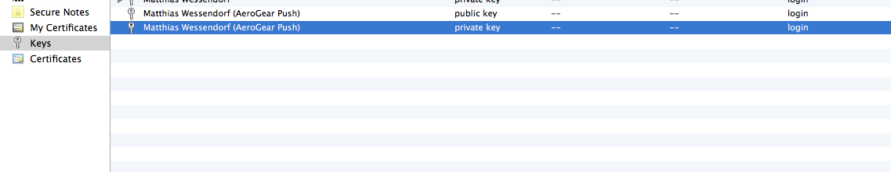

## Android
 - AEROGEAR-10136	
## iOS
 The following step-by-step guides, give you an introduction on how to use the AeroGear UnifiedPush Server for sending 
 Push Notifications to your own iOS Apps. The guide assumes you have an Apple developer account already setup as well 
 as a real iOS device (not through emulator) for testing.

### Apple App ID and SSL Certificate for APNs
 Before you are able to use Push Notifications on your iOS Application, a few steps are required. This section of the 
 tutorial gives a quick overview of what is needed.
 
#### Certificate Signing Request
 First you need to submit a request for a new digital certificate, which is based on a public/private key. The 
 Certificate itself is acting as the public key, and when you request it, a private key is added to your **KeyChain** 
 tool. The Cerficate will be used later on, to request an SSL certificate for the Apple Push Network Service, which 
 will allow the _AeroGear Push Server_ to send notification messages to it. Now the actual CSR (Certificate Signing 
 Request) is done using **KeyChain Access** tool found in **Applications > Utilities** folder on your Mac. Once opened, in 
 the **KeyChain Access** menu, choose **Certificate Assistant > Request a Certificate** from a **Certificate Authority**:
 
 > 
 
 Make sure that you have chosen to store the CSR on file, so we can upload it later in the provisioning portal when 
 requesting the actual SSL cert. Going back to **KeyChain Access** you now see a new private key:
 
 > 
 
#### Apple App ID and SSL certificate for APNs
 Now that the CSR is generated, go to the [Provisioning Portal](https://developer.apple.com/account/overview.action) 
 and log in with your Apple developer account. Now, click on the **Identifiers** link in order to create a new App ID 
 (use the **PLUS** Icon on the right). 
 In the window that will appear, select **App IDs**
 
 > 
 
 Click on _continue_. In the form that will appear:
  * select _iOS, tvOS, watchOS_, give the **App ID** a _descriptive_ name, like **My first AeroGear Push App**
  * select **Bundle ID Explicit** (generic **Wildcard App ID** does not work with Push)
  * In the _Bundle ID_ field enter **YOUR** bundle ID. This is similar to Java packages. In this example we choose 
    _org.aerogear.PushHelloWorld_, however you must use your own ID
  * Double check that the **Push Notifications** checkbox is selected in the list of _Capabilities_:
 
 | **NOTE**: The _Bundle ID_ has to match the one from the actual iOS application that you are building later in this guide. |
 | --- |
 
 > 

In the next screen confirm your new App ID, and double check that the _Push Notifications_ option is enabled. 
Afterwards click the _Register_ button! Now you are Done. 
Finally, click on on the newly created App ID. After clicking on it, ensure that the _Push Notifications_ capability
is enable and click on the _Configure_ button close to that.
The following screen will appear:

 > 

Here we are asked to generate a _Development_ and a _Production_ certificate that will be used by the UnifiedPush server 
when contacting the Apple Push Notification service to send messages. If you plan to distribute your app in the 
App Store, you are required to generate a Production certificate. In this guide we will generate both 
Certificates and register them with the UnifiedPush server.

Let’s start first by generating the _Development Certificate_. Click the _Create Certificate_ button on the 
_Development SSL Certificate_ section:

## Webpush
 - AEROGEAR-10134
## cordova
 - AEROGEAR-10133