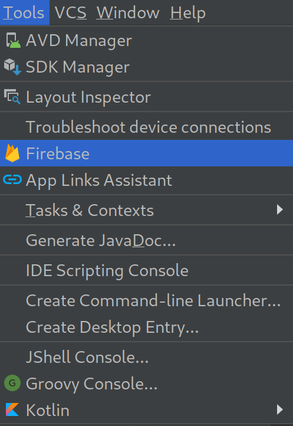
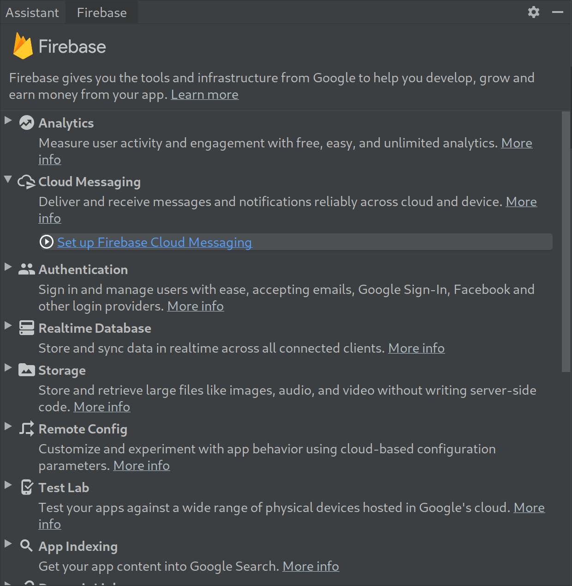
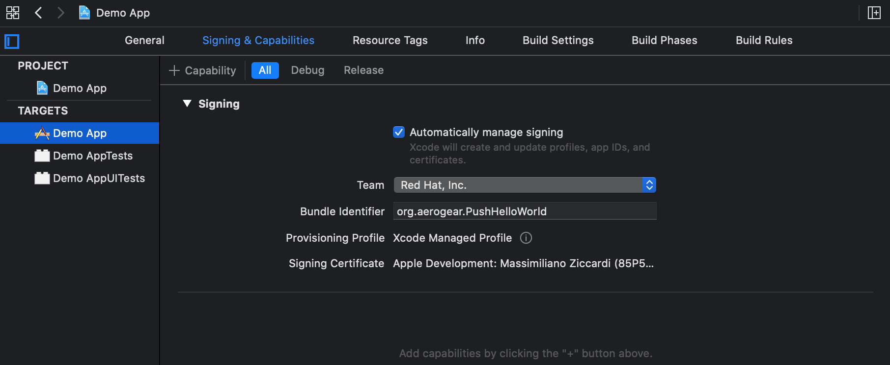
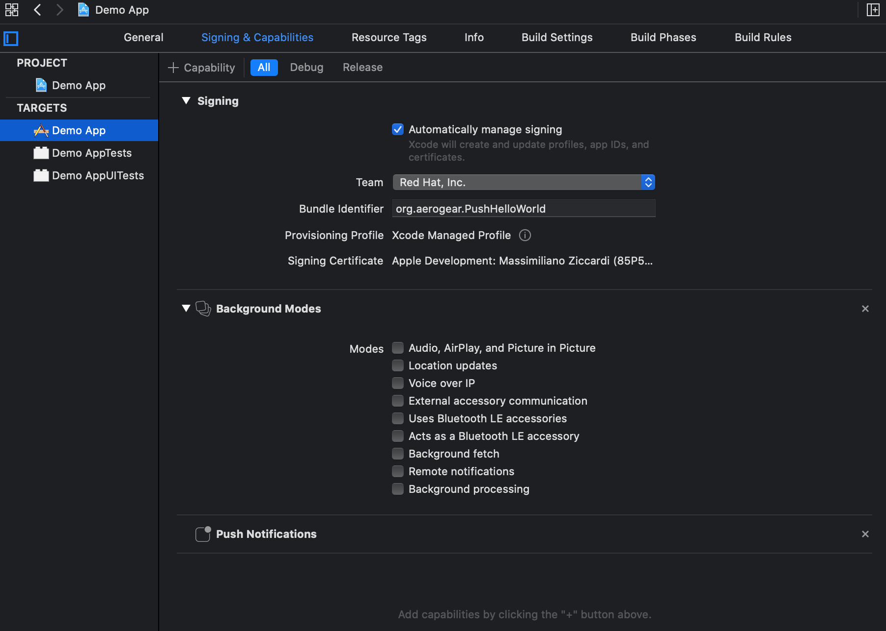
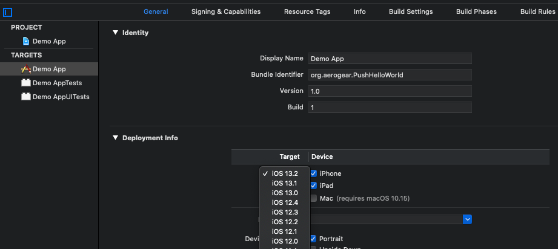

## Android
 Before you begin configuring an Android application to receive push messages, you should have the following installed, available, or configured as appropriate.

  * Android Studio
  * Google Firebase Account
  * Android Emulator or device with Google Play Services
  * Unified Push with an Android Variant Configured
 
### Overview
Unified Push makes use of Google's Firebase Cloud Messaging service (FCM).  Before you can use push messages with Android you will need to create a Firebase project.  Android Studio can guide you through this process.  Once you have your Firebase project set up, you can enable Firebase in your Android application.  Like before, Android Studio has tools to facilitate this.  These steps are covered in the section *Firebase Configuration with Android Studio*.

Once you have Firebase configured in your application, you can configure Unified Push.  This involves adding the Unified Push libraries to your Android project, and adding a configuration file to your assets folder.  With the configuration in place, you can begin using the Unified Push SDK. Configuration and usage are discussed beginning with the section *Configure the Unified Push SDK*

### Firebase Configuration with Android Studio
Android Studio can automate much of the Firebase integration process using the Firebase Assistant.

Access the assistant from the **Tools > Firebase** menu item.

>  

In the assistant select **Set up Firebase Cloud Messaging**. 

> 

Then follow the wizards launched by the *Connect to Firebase*.  The Firebase project name you choose to use should match the name of the Firebase project you used to configure your Android Variant.

> 

Finally, press the *Add FCM to your app* button and Android Studio will configure your build files so that your application can connect to Firebase.

> 


The other steps in the Firebase Assistant are handled by Unified Push and its SDKs and may be ignored.

### Configure the Unified Push SDK

The Unified Push SDK needs to be added to your project and configured.  

To add the SDK to your project, add the following to you application's build.gradle dependencies:

```gradle
    implementation 'org.jboss.aerogear:aerogear-android-push:5.1.0'
```

Now create a file `push-config.json` in `app/src/main/assets` folder.  Use the following template and copy the value from your variant in the Unified Push admin console.


```json
{
  "pushServerURL": "pushServerURL (e.g http(s)//host:port/context)",
  "android": {
    "senderID": "senderID (e.g Google Project ID only for android)",
    "variantID": "variantID (e.g. 1234456-234320)",
    "variantSecret": "variantSecret (e.g. 1234456-234320)"
  }
}
```

Ensure that you put valid values on those params, otherwise you would be unable to register and receive notifications from the UnifiedPush server. Invalid configuration params are a very common source of problems, so please revisit them if you are experiencing problems.

### Register With Unified Push

The entry point for registration is the [RegistrarManager](https://github.com/aerogear/aerogear-android-push/blob/master/library/src/main/java/org/jboss/aerogear/android/unifiedpush/RegistrarManager.java). This is a *factory* of different implementations of the [PushRegistrar](https://github.com/aerogear/aerogear-android-push/blob/master/library/src/main/java/org/jboss/aerogear/android/unifiedpush/PushRegistrar.java) interface which contain the actual registration/unregistration methods.

By default, the method will return an implementation that supports registration with the UnifiedPush server. Having the flexibility of a factory method, allows us in the future to expand it to support other different message brokers under a common messaging interface.

Since the registration setup is an one-step process not bound to any Android 'Activity', let's encapsulate it in a subclass of an Android [Application](http://developer.android.com/reference/android/app/Application.html).

Create a new class, name it `PushApplication` and paste the following code:

```java
package com.push.pushapplication;

import android.app.Application;

import org.jboss.aerogear.android.unifiedpush.PushRegistrar;
import org.jboss.aerogear.android.unifiedpush.RegistrarManager;
import org.jboss.aerogear.android.unifiedpush.fcm.AeroGearFCMPushJsonConfiguration;

public class PushApplication extends Application {

    private static final String PUSH_REGISTAR_NAME = "myPushRegistar";

    @Override
    public void onCreate() {
        super.onCreate();

        PushRegistrar pushRegistrar = RegistrarManager
                .config(PUSH_REGISTAR_NAME, AeroGearFCMPushJsonConfiguration.class)
                .loadConfigJson(getApplicationContext())
                .asRegistrar();

    }

}

```

The setup of the registration happens on the `onCreate` lifecycle method called when Android first initializes your application. It will create (and store) a [PushRegistrar](https://github.com/aerogear/aerogear-android-push/blob/master/library/src/main/java/org/jboss/aerogear/android/unifiedpush/PushRegistrar.java) object based on `push-config.json` configuration declared earlier. This object together with a name (it can be anything you choose) are passed as params on the `config` factory method to create the `PushRegistrar` object.


We are now ready to call *PushRegistrar:register* method to register our device in the UnifiedPush server. The following code goes after you assign the pushRegistrar in your Application class.

```java

    pushRegistrar.register(getApplicationContext(), new Callback<Void>() {
        @Override
        public void onSuccess(Void data) {
            Log.d(TAG, "Registration Succeeded");
            Toast.makeText(getApplicationContext(),
                    "Yay, Device registered", Toast.LENGTH_LONG).show();
        }

        @Override
        public void onFailure(Exception e) {
            Log.e(TAG, e.getMessage(), e);
            Toast.makeText(getApplicationContext(),
                    "Ops, something is wrong :(", Toast.LENGTH_LONG).show();
        }
    });

```

Don't forget to configure the Application class in `AndroidManifest.xml`
```xml
<application
    android:name=".PushApplication"
    ...
/>
```

That is all what is needed to register with the UnifiedPush server! Note that we didn't have to write any code to register the device with FCM. The library takes care off all the plumbing to register the device with FCM, obtain the `registrationId` and submit it to the UnifiedPush server.


[NOTE]
If you don't see the _Registration Succeeded_ popup, means that an error has occurred during the registration. Switch to the LogCat console in Android Studio to locate the exception and act accordingly.


### Register Message Handlers

Classes which implement the MessageHandler interface may be registered with the Unified Push SDK to handle notifications send from the Unified Push Server.  These classes may be executed on the main thread, or in background threads.  You may also provide a default handler that is executed if a message is received while your application is not running.

#### Registering and Unregistering and The Activity Lifecycle

When your Activity comes into the foreground you will want to register any MessageHandlers that need to run in the main thread.  Likewise when your Activity is in the background, you will want to have your main thread handlers disabled.  You may do this by overriding the onPause and onResume methods. 

At a minimum, your code should resemble :

```java
//messageHandler is a field that points to a messageHandler

@Override
protected void onResume() {
    super.onResume();
    RegistrarManager.registerMainThreadHandler(messageHandler); 
}

@Override
protected void onPause() {
    super.onPause();
    RegistrarManager.unregisterMainThreadHandler(messageHandler); 
}
```

If you wish, you may also have background thread handlers.

```java
RegistrarManager.unregisterBackgroundThreadHandler(messageHandler);
```

```
RegistrarManager.registerBackgroundThreadHandler(messageHandler);
```

### Hello World Example

The AeroGear project provides an example Unified Push application in their [android-cookbook repository](https://github.com/aerogear/aerogear-android-cookbook/tree/master/HelloPush)

## iOS

Prerequisites: to be able to follow the instructions below, you must have [cocoapods](https://cocoapods.org/)
 installed and working and you must have a [variant](./configuring_variants.md#ios) already configured.
For instructions on how to setup [cocoapods](https://cocoapods.org/) see [here](https://guides.cocoapods.org/using/getting-started.html)

### Create a new project

Open `XCode` and create a new project selecting `iOS` and `Single View App`:

 >

Click `Next`. In the next page, insert the name of you application (in this example _Demo App_) and select your team.

 >

:::warning
If you plan on supporting _iOS 12_ or older, change _User Interface_ to _Storyboard_.
:::

Click on `Finish` and save the app in a folder of your choice. Take note of that folder since we are going to open
a terminal there.

:::note
Take note of the folder you will save the project in, since you will need to go there with the terminal and run some command to install the required pods!
:::

### Add required capabilities

Click on the project to show the screen below:

 >

Select the _Sign & Capabilities_ tab and click on the `+` button in the upper left corner to add the following capabilities:
* Background Modes
* Push Notifications

:::important
To be able to add the _Push Notifications_ capability be sure you select the right team and that the team has an active membership.
:::

After you have added both capabilities your window should look as below:

 >

Now, be sure you click in `Remote notifications` under `Background Modes` to enable it:

>

:::warning
If you are using _XCode 11_, the generated project won't work with _iOS 12_ or older. If you need to support _iOS 12_, follow the [_Make the application backward compatible_](#make-the-application-backward-compatible) guide.
:::

### Add the pod dependencies

Close _XCode_ and open a terminal, then change your current directory to the folder where you saved your project.
You should see a content similar to the image below:

>

from there run

```
pod init
```

That will create a `Podfile` file in the current folder with the following content:

>```bash
># Uncomment the next line to define a global platform for your project
># platform :ios, '9.0'
>
>target 'Demo App' do
>  # Comment the next line if you don't want to use dynamic frameworks
>  use_frameworks!
>
>  # Pods for Demo App
>
>  target 'Demo AppTests' do
>    inherit! :search_paths
>    # Pods for testing
>  end
>
>  target 'Demo AppUITests' do
>    # Pods for testing
>  end
>end
>```

Uncomment the platform as suggested and add
```
pod 'AeroGearPush-Swift', '~> 3.1.0'
```

to the `Podfile`:

>```bash
>platform :ios, '9.0'
>
>target 'Demo App' do
>  # Comment the next line if you don't want to use dynamic frameworks
>  use_frameworks!
>
>  # Pods for Demo App
>  pod 'AeroGearPush-Swift', '~> 3.1.0'
>
>  target 'Demo AppTests' do
>    inherit! :search_paths
>    # Pods for testing
>  end
>
>  target 'Demo AppUITests' do
>    # Pods for testing
>  end
>end
>```

and run
```
pod install
```

you will end having a `.xcworkspace` file (in my case `Demo App.xcworkspace`).
Open it with XCode:

```bash
open Demo\ App.xcworkspace
```

:::warning
Remember to close `XCode` before running the `open` command
:::

### Asking permissions for receiving push messages
Before you can receive any _push notification_ the first thing needed is to ask the user permissions to receive push notifications.
That can be done in the `AppDelegate` class with the code below:

```swift
class AppDelegate: UIResponder, UIApplicationDelegate {
    func application(_ application: UIApplication, didFinishLaunchingWithOptions launchOptions: [UIApplication.LaunchOptionsKey: Any]?) -> Bool {
        // bootstrap the registration process by asking the user to 'Accept' and then register with APNS thereafter
        UNUserNotificationCenter.current().requestAuthorization(options: [.alert, .badge, .sound], completionHandler: { (granted, error) in
        })
        UIApplication.shared.registerForRemoteNotifications()
        
        // Override point for customization after application launch.
        return true
    }
...
}
```

### Registering your app

If the user grants permissions to receive _push notification_, the next step is to register the app to the _Unified Push Server_.
To be able to perform such operation, you will need the following information:
  * The _URL_ of the _Unified Push Server_ instance
  * The _ID_ of an _iOS_ variant you previously created in UPS (to see how, look [here](./configuring_variants#ios)) 
  * The _secret_ of the _iOS_ variant

To register the app the SDK offers the `DeviceRegistration` object, which, in turns, offers two different initializers:
  1. `DeviceRegistration(config: "<#NAME OF A PLIST FILE#>")`: this is to be used when the parameters for the 
     configuration are stored into a `plist` file
  2. `DeviceRegistration(config: "<#Unified Push Server URL#>")`: this is to be used when the connection 
     parameters are passed programmatically

:::tip
A good place to put the registration code could be
```swift
func application(_ application: UIApplication, didRegisterForRemoteNotificationsWithDeviceToken deviceToken: Data)
```
of the `AppDelegate` class
:::

#### Registering using a plist file
```swift
// setup registration. 'pushconfig' is the name of the 'plist' file
let registration = DeviceRegistration(config: "pushconfig")

// attempt to register
registration.register(
        clientInfo: { (clientDevice: ClientDeviceInformation!) in
            // setup configuration
            clientDevice.deviceToken = deviceToken

            // apply the token, to identify THIS device
            let currentDevice = UIDevice()

            // set some 'useful' hardware information params
            clientDevice.operatingSystem = currentDevice.systemName
            clientDevice.osVersion = currentDevice.systemVersion
            clientDevice.deviceType = currentDevice.model
        },
        success: {
            print("UnifiedPush Server registration succeeded")
        },
        failure: { (error: Error!) in
            print("failed to register, error: \(error.localizedDescription)")
        }
)
```

The `plist` file must contain three string properties:
  * **serverURL**: the url of the _Unified Push Server_
  * **variantID**: the ID of the iOS variant associated with this application
  * **variantSecret**: the secret of the iOS variant associated with this application 

To make it work with the example above, name the plist file `pushconfig.plist`.

#### Registering programmatically

```swift
// setup registration
let registration = DeviceRegistration(serverURL: URL(string: "<#AeroGear UnifiedPush Server URL#>")!)

// attempt to register
registration.register(
        clientInfo: { (clientDevice: ClientDeviceInformation!) in
            // setup configuration
            clientDevice.deviceToken = deviceToken
            clientDevice.variantID = "<# Variant Id #>"
            clientDevice.variantSecret = "<# Variant Secret #>"

            // apply the token, to identify THIS device
            let currentDevice = UIDevice()

            // -- optional config --
            // set some 'useful' hardware information params
            clientDevice.operatingSystem = currentDevice.systemName
            clientDevice.osVersion = currentDevice.systemVersion
            clientDevice.deviceType = currentDevice.model
        },
        success: {
            print("UnifiedPush Server registration succeeded")
        },
        failure: { (error: Error!) in
            print("failed to register, error: \(error.localizedDescription)")
        }
)
```

To make the code work, remember to replace the placeholder with the real values.

### Handle the push notifications

To handle the notification, in you `AppDelegate.swift` override the following method:

```swift
func application(_ application: UIApplication, didReceiveRemoteNotification userInfo: [AnyHashable: Any], fetchCompletionHandler: @escaping (UIBackgroundFetchResult) -> Void)
```

the `userInfo` parameters will contains all the information about the notifications. For further details, refer
to the [apple website](https://developer.apple.com/documentation/uikit/uiapplicationdelegate/1623013-application).

### The Example application

An example application can be found [here](https://github.com/aerogear/aerogear-ios-cookbook/tree/master/UnifiedPushHelloWorld).
To run it, follow the instruction in the [README](https://github.com/aerogear/aerogear-ios-cookbook/blob/master/UnifiedPushHelloWorld/README.md) file.

### Make the application backward compatible

:::important
These steps are required only if you created the project with _XCode 11_ and you need to support _iOS 12_ or older
:::

To make an application created with _XCode 11_ work with _iOS 12_ or older, few steps are necessary.

#### Change the deployment target

By default, when you create an application with _XCode 11_, it targets _iOS 13_. 

To change the deployment target, open the project settings and go to the _General_ tab as shown below:

>

#### Make the code backward compatible

The _XCode 11_ application template, by default uses lot of things that are not available in _iOS 12_: to fix those issues, 
we will have to mark them with the `@available` keyword.

1. Change the `ContentView.swift` file so that its content is marked as available only on _iOS13_:

```swift
import SwiftUI

@available(iOS 13.0, *)
struct ContentView: View {
    var body: some View {
        Text("Hello, World!")
    }
}

@available(iOS 13.0, *)
struct ContentView_Previews: PreviewProvider {
    static var previews: some View {
        ContentView()
    }
}
```

2. Do the same for the `SceneDelegate.swift`

```swift
@available(iOS 13.0, *)
class SceneDelegate: UIResponder, UIWindowSceneDelegate {
...
```

3. In the `AppDelegate` mark with the `@available` keyword each method referring to the `UIScene*` classes

```swift
@available(iOS 13.0, *)
func application(_ application: UIApplication, configurationForConnecting connectingSceneSession: UISceneSession, options: UIScene.ConnectionOptions) -> UISceneConfiguration {
    // Called when a new scene session is being created.
    // Use this method to select a configuration to create the new scene with.
    return UISceneConfiguration(name: "Default Configuration", sessionRole: connectingSceneSession.role)
}

@available(iOS 13.0, *)
func application(_ application: UIApplication, didDiscardSceneSessions sceneSessions: Set<UISceneSession>) {
    // Called when the user discards a scene session.
    // If any sessions were discarded while the application was not running, this will be called shortly after application:didFinishLaunchingWithOptions.
    // Use this method to release any resources that were specific to the discarded scenes, as they will not return.
}
```

4. Add a `UIWindow` member variable to the `AppDelegate`

```swift
@UIApplicationMain
class AppDelegate: UIResponder, UIApplicationDelegate {
    var window: UIWindow?
...
```

If you created the application selecting _Storyboard_ as _User Interface (see [Create a new project](#create-a-new-project)), we are done: the application now works on _iOS 12_.
Otherwise you will have to manually create a storyboard.
## Webpush
 - AEROGEAR-10134
## cordova
npm install - AEROGEAR-10133