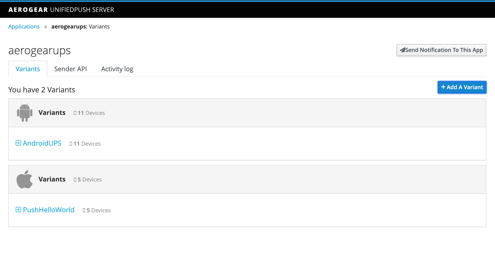
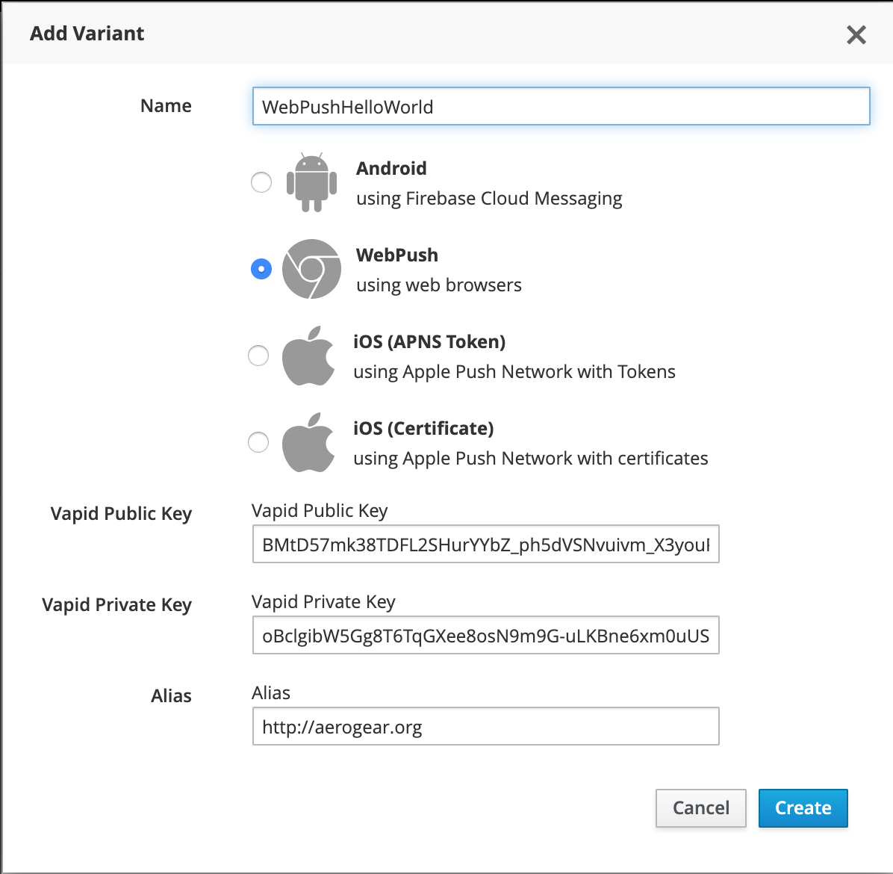
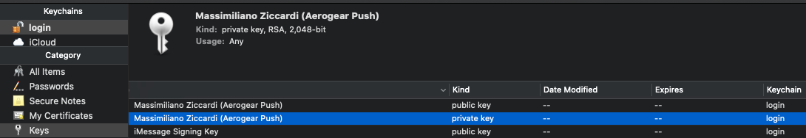
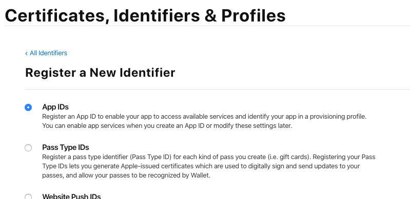
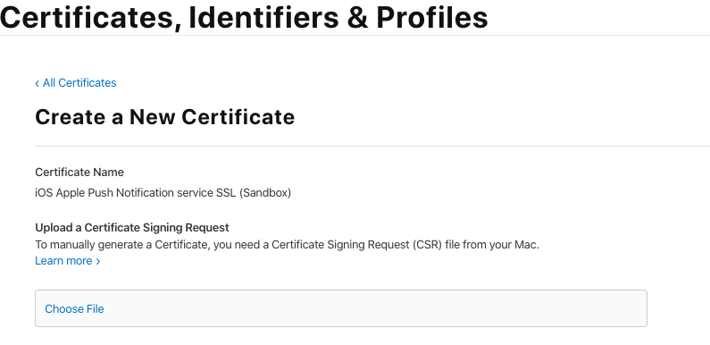
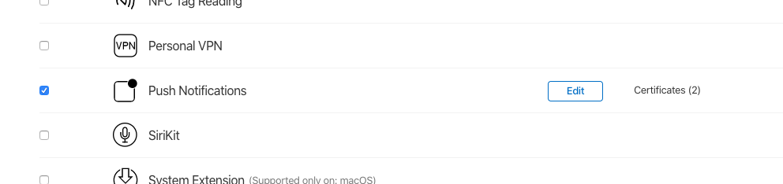
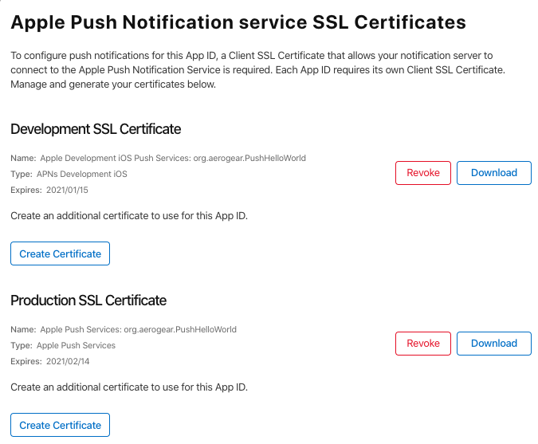

## WebPush
 The following step-by-step guide gives you an introduction on how to use the _AeroGear UnifiedPush Server_ for sending 
 _Web Push Notifications_ to your web application.
 
### Create WebPush Variants

 Before you can create a _WebPush Variant_ into the _UnifiedPush Server_ you need to get your VAPID Keys 
 (see [The Web Push Protocol](https://developers.google.com/web/fundamentals/push-notifications/web-push-protocol) for details).
 You can use, for example, [this site](https://tools.reactpwa.com/vapid) to generate them.

 As soon as you have the keys, open (or create) an UPS application and click on the `Add A Variant` button

 > 

 A popup will open. Select `WebPush` and fill the data:
 * Vapid Public Key: your vapid public key
 * Vapid Private Key: your vapid private key
 * Alias: The application server contact informations (this must be a `mailto` or an `https` url)
 
 > 

Click on `create` and your webpush variant is ready!

## Android
	AEROGEAR-10142
## iOS
### APNs Certificate
 The following step-by-step guide gives you an introduction on how to use the AeroGear UnifiedPush Server for sending 
 Push Notifications to your own iOS Apps. The guide assumes you have an Apple developer account already setup, and uses tools available in macOS.

#### Apple App ID and SSL Certificate for APNs
 Before you are able to use Push Notifications on your iOS Application, you must configure the Apple Push Notification service (APNs) with a certificate. 
 
##### Certificate Signing Request
 First you need to submit a request for a new digital certificate, which is based on a public/private key. The 
 Certificate itself is acting as the public key, and when you request it, a private key is added to your **KeyChain** 
 tool. The Cerficate will be used later on, to request an SSL certificate for the Apple Push Network service, which 
 will allow the _AeroGear Push Server_ to send notification messages to it. Now the actual CSR (Certificate Signing 
 Request) is done using **KeyChain Access** found in the **Applications > Utilities** folder on your Mac. Once opened, in 
 the **KeyChain Access** menu, choose **Certificate Assistant > Request a Certificate** from a **Certificate Authority**:
 
 > 
 
 Make sure that you have chosen "Saved to disk" to save the CSR locally; we will upload it later in the provisioning portal when 
 requesting the actual SSL cert. Going back to **KeyChain Access** you now see a new private key:
 
 > 
 
##### Apple App ID and SSL certificate for APNs
 Now that the CSR is generated, go to the [Provisioning Portal](https://developer.apple.com/account/overview.action) 
 and log in with your Apple developer account. Now, click on the **Identifiers** link in order to create a new App ID 
 (use the **PLUS** Icon on the right). 
 In the window that will appear, select **App IDs**
 
 > 
 
 Click on _continue_. In the form that will appear:
  * select _iOS, tvOS, watchOS_, give the **App ID** a _descriptive_ name, like **My first AeroGear Push App**
  * select **Bundle ID Explicit** (generic **Wildcard App ID** does not work with Push)
  * In the _Bundle ID_ field enter **YOUR** bundle ID. This is similar to Java packages. In this example we choose 
    _org.aerogear.PushHelloWorld_, however you must use your own ID
  * Double check that the **Push Notifications** checkbox is selected in the list of _Capabilities_:
 
 | **NOTE**: The _Bundle ID_ has to match the one from the actual iOS application that you are building later in this guide. |
 | --- |
 
 > 

In the next screen confirm your new App ID, and double check that the _Push Notifications_ option is enabled. 
Afterwards click the _Register_ button! Then, click on on the newly created App ID, and ensure that the _Push Notifications_ capability
is enable and click on the _Configure_ button close to that.
The following screen will appear:

 > 

Here we are asked to generate a _Development_ and a _Production_ certificate that will be used by the UnifiedPush server 
when contacting the Apple Push Notification service to send messages. If you plan to distribute your app in the 
App Store, you are required to generate a Production certificate. In this guide we will generate both 
Certificates and register them with the UnifiedPush server.

Let’s start first by generating the _Development Certificate_. Click the _Create Certificate_ button on the 
_Development SSL Certificate_ section:

 > 

Choose the _Certificate Signing Request_ you generate before and click on _Continue_: that will sign your certificate 
request and will give you the chance to download your newly generated certificate.

By following the same steps as before, you can now generate a production certificate too.

Now, if you go to your identifier, the _Push Notifications_ capability will appear as below:

 > 

Click on _Edit_:

 > 

Download and install the certificate (double click on it and choose `login` as keychain)
Open the KeyChain an select the `login` keychain and the `My Certificates` category:

 > 

Now you have to export this certificate/private key pair as **Personal Information Exchange (.p12)**. This file will 
be uploaded later on to the AeroGear Push Server enabling it to authorize itself for your development application on 
Apple Push Network Service and send messages to it.

 > 

When exporting the file you need to assign a passphrase that will protect the private key. Make note of the passphrase, because later 
when uploading the private key to the _AeroGear Push Server_ you will need both the exported file and the passphrase.

Follow the same steps to download the _Production SSL Certificate_, the file is being downloaded as aps_production.cer. 
This file will be uploaded later on to the AeroGear Push Server enabling it to authorize itself for your production 
application on Apple Push Network Service and send messages to it.

#### The Unified Push Server
APNs is now configured and we are now ready to setup the _UnifiedPush Server_ to connect to APNs and send push messages.

In the Wizard after you create a PushApplication, click the **Add Variant** button and fill out the iOS option. 
You will want to use the certificate and passphrase you create earlier:

 > 

Afterwards you will see some code snippets containing the **Variant ID** and **Secret** that you can use in your iOS 
application for registering the device when running your app:

 > 

| **NOTE**: Clicking on the appropriate tab, you can choose between Objective-C, Swift and Cordova snippet |
| --- |

### APNs Token
	AEROGEAR-10140
